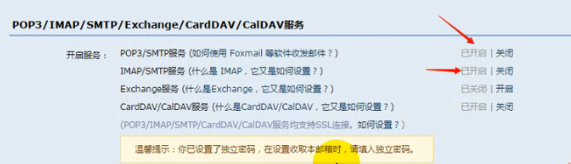
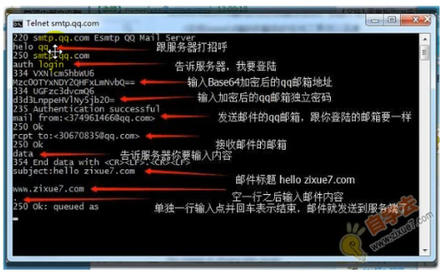

# Socket编程基础_01——C语言实现邮件收发

## 1 邮件协议SMTP

​	SMTP简单Mail传输协议（Simple Mail Transfer Protocal）

* 接力式传送

两种工作情况：

* 电子邮件从客户机传输到服务器
* 从一个服务器传输到另一个服务器

SMTP是一个请求/想用协议，监听25号（默认，可配置）端口，用于接受Mail请求，并与远端Mail服务器建立SMTP连接

## 2 C语言邮件发送

* 与SMTP服务器通讯
* 理解SMTP协议，使用程序发送邮件给SMTP服务器

## 3 telnet(工具)发送邮件过程

[tenlent邮件发送](http://www.zixue.com/thread-25813-1-1.html)

* 邮箱客户端设置打开SMTP支持，设置独立密码（用于SMTP客户端登陆）

* windows系统打开telnet支持

* 命令行telnet打开客户端
* 启动本地回显>set localecho

* 建立连接(o可用open代替，最后表示端口号)> o smtp.qq.com 25

* **打开回显 > ehlo 主机名（随意）**
* 登录请求 > auth login
* 输入加密后的邮箱地址（base64加密）
* 输入加密后的授权码（base64加密）
* 后续操作见上图
* （可以在data中首先输入From:---伪造发件人，再输入rcpt to:---）

 QQ邮箱授权码相关http://service.mail.qq.com/cgi-bin/help?subtype=1&&id=28&&no=1001256

telnet链接与邮件发送参考：https://blog.csdn.net/Activity_Time/article/details/99732863

## 4 编程完成邮件的发送