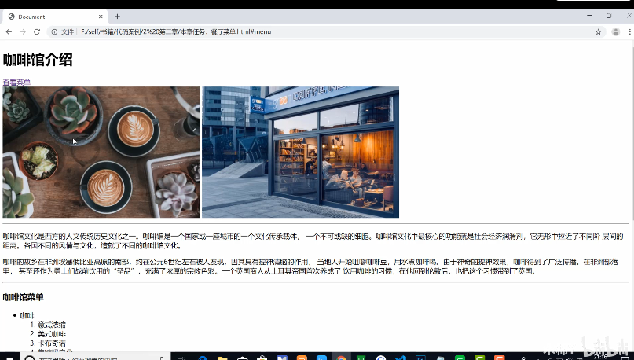
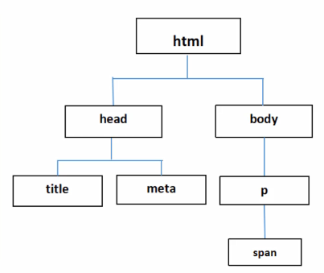
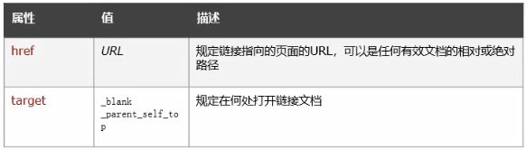
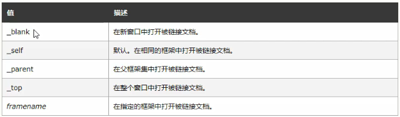

# 第二章 html5语法和基础标签

第二章作业：咖啡馆介绍，三级菜单，链接跳转



HTML控制网页结构，CSS控制样式，JS控制网页动态效果

## 1.HTML

（Hyper Text Markup Language）：超文本标记语言

​	包含了只想其他文档的标签（超链接）的文档

​	Html文档或站名为html或htm，通知浏览器文件类型

## 2.标签

**标签**：HTML标签是由尖括号包围的关键字，如h1是一个标明的关键字，给h1加上尖括号，就成了<h1>标签。标签分为开始标签和结束标签，结束标签需要添加"/"

**元素** ：一个元素通常由一个开始标签+内容+结束标签组成

**注释** ：<! 此处是注释>

## 3.HTML文档基本结构

```html
<!DOCTYPE thml> <!html5解析声明，声明使用HTML5标准来解析文档>
<html>	<!根元素>
    <head>	<!头部>
        <title>HTML教程</title>
        <!title中内容会显示在浏览器窗口中，也会作为标题显示在搜索引擎搜索结果中>
    </head>
    <body>
        <!主体，显示在浏览器中的内容>
    </body>
</html>
```

Hbuilder中写完一句话，ctrl + ？可快速转为注释

-**head标签** 包含网页信息，帮助浏览器解析页面。不会在浏览器中显示

​	-**title标签** 显示在浏览器窗口，表示整个页面的标题，在浏览器检索的时候，第一个检索标签的内容，它会影响浏览器解析顺序

​	-**meta标签** 自结束标签，自结束标签可在最后加一个斜杠表示结束，也可以不加

```html
<meta charset = "utf-8"> <!-- 设置编码字符集为utf-8 -->
```

​	通常将字符集声明放在最前面（title前面）

## 4.元素嵌套



​	标签之间具有父子关系

​	元素不可以进行交叉嵌套，只能完整嵌套，（不符合完整嵌套语法时，浏览器可能会自动修正，但不一定符合预期要求）

​	标签em具有倾斜效果，如下，HTML将会出现倾斜效果

```html
<body>
    <div>
        我们一起学习<em>HTML</em>吧
    </div>
</body>
```

## 5.HTML基础标签

1.**<h1>……<h6>标签**

​	用户可以通过标题快速浏览网页，因而使用标签呈现文档结构十分重要

​	按照标题级别，通常将<h1>作为最重要的主标题，<h2>作为次要标题，一次类推，<h1>标签可能会影响到王爷在搜索引擎中的排名，只能使用一次

​	h1~h6在浏览器中会以一个默认的字体大小依次递减，也可以自己设置

​	搜索引擎通常先检测title标签，之后则检测h1标签，对搜索结果进行分类排序，因而**一个页面中h1标签只能存在一个** title与h1标签均影响搜索排名

​	通常只使用h1~h3表示网页中的多级标题

2.**p标签**

​	p标签标记一个段落，每个段落另起一行，且不同段落之间默认存在一定间隔

​	浏览器不认识回车换行以及大多数空格，都会以一个空格的形式展示在页面中（忽略大多数空格）

3.**br标签**	换行	没有结束标签	没有内容	被称为空标签

​	**hr标签**	横线	空标签

## 6.文本格式化标签

```html
<strong> 定义加重语气（加粗，有语义）</strong>
<em> 定义着重文字（斜体，有语义） </em>
<sub> 定义下标字 </sub>
<sup> 定义上标字 </sup>
<b> 加粗文本（无语义） </b>
<i> 粗体字 （无语义）</i>
<big> 大字号（相对于父级字体的增大） </big>
<small> 小字号 （相对于父级字体的减小）</small>
<ins> 插入字 </ins>
<del> 删除字 </del>
```

## 7.超链接

1.超链接

​	指从一个网页指向另一个目标的连接关系，这个目标可能是另一个网页，也可能是相同网页上的不同位置，还可以是一个图片等等

```html
<a href = "url">link text</a>
```

2.属性



​	跳转功能

​	书签功能（同页面跳转）

3.绝对路径与相对路径

a标签的herf属性：跳转新页面，不保留原页面

a标签的target属性：在浏览器创建一个新的访问页面，打开超链接页面



超链接的锚点功能：跳转到同一页面的固定位置