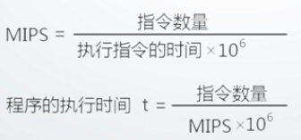

# 第一章 计算机系统概论

## 1.0 课程导学

计算机组成原理

__目标：学习运算器、控制器、存储器结构、工作原理、设计方法及互联构成整机的相关技术__

## 1.0.1 重要性

## 1.0.2 学习方法

### 1：构造观+系统观+工程观的学习视角和学习方法

构造观——掌握设计方法

* 设计功能部件：基本编码/解码器、运算器、控制器、储存器

* 设计系统：简单计算机系统

* 利用仿真软件Logisim

系统观——软/硬件协同的视角

* 理解计算机系统的构成及各部分之间的相互影响

* 理解不同系统/结构对程序的影响（功能、性能、可移植性等方面）

* 工程观——系统实现视角

### 2：实践

### 3：练习、交流、思考

-------

## 1.1 冯·诺依曼结构

* 存储程序

* 程序控制

冯·诺依曼体系结构组成——硬件+软件

### 一、硬件

#### 1.运算器

算术运算、逻辑运算

基本结构：ALU（Arithmetic　Logical　Unit）、寄存器、连接通路

结构与功能相关联

#### 2.控制器

基本功能：产生执行过程所需要的所有控制信号，控制相关功能部件执行相应操作。

控制信号形式：电平信号、脉冲信号

产生控制信号的依据：指令、状态、时序

#### 3 存储器

基本功能：存储原程序、原数据、运算中间结果

工作模式：读/写

工作原理：按地址访问，读/写数据

容量——地址总线数量

​	1k——10

​	1M——20

​	1G——30

#### 4.输入输出设备

### 二、软件

* 可运行的思想内容的数字化

  思想：算法、规律、方法——程序表达

  内容：图形、图像、数据、声音、文字等被处理的对象

* 软件的表现形式：程序和数据（二进制形式）
* 软件的核心：算法

#### 软件分类

* 系统软件

  操作系统、网络系统、编译系统

* 支持软件

  开发工具、界面工具等

* 应用软件

  字处理软件、游戏等

### 三、硬件软件关系

#### 1.相互依存

​	硬件是软件运行的基础、软件的正常运行是硬件发挥作用的重要途径。计算机必须要配备完善的软件系统才能正常工作。期额应充分发挥期硬件的功能

#### 2.逻辑等效应

​	某些功能可由硬件实现，也可由软件实现

#### 3.协同发展

​	软件随硬件的迅速发展而发展，而软件的不断发展与完善有促进硬件的更新，两者密切交织，缺一不可

### 四、计算机的层次结构

* 不同语言处于不同层次

* 不同层次具有不同属性
* 不同层次使用不同工具
* 不同层次代码效率不同

相关概念

* 透明性概念

  ​	本来存在的事物或属性，从某个角度去看，却好像不存在

  ​	硬件的特性对C语言程序设计者而言就具有透明性

* 系统观

  ​	硬件结构发生变化时，可能对软件产生的影响

  ​	不同类型软件对硬件有不同要求

  ​	编程的CPU硬件相关性，编程应查阅对应CPU的编程手册

* 软硬件分界线

  分界线是软、硬件的接口、是指令操作硬件的接口

  指令及指令的设计与硬件相关

  

##　1.2 计算机系统性能评价

#### 1.非时间指标

##### (1) 机器字长

​	指机器一次能处理的二进制数的位数

* 由加法器、寄存器位数决定
* 一般与内部寄存器的位数相等
* 字节越长、表示的数据范围就越大，精确度就越高
* 目前常见的有32位和64位

#####　(2) 总线宽度

​	数据总线一次能并行传送数据的最大信息位数

* 一般指运算器与存储器之间的数据总线位数
* 有些计算机内部与外部数据总线宽度不一致

##### (3) 主存容量与储存带宽

* 主存容：指一台计算机贮存所包含的储存单元总数
* 存储带宽：值单位时间内与贮存交换的二进制信息量，常用字节/秒（B/ｓ）表示. （影响储存贷款的指标，包括数据位宽和数据传输速率）

#### 2 时间指标

##### (1) 主频f、时钟周期T、外频、倍频

* 主频f

  ​	CPU内核人工作的时钟频率，即CPU内脉冲信号震荡的速率，与CPU的实际运算能力之间不是唯一的、直接关系。

* 时钟周期T

  ​	也称节拍周期，是计算机中最基本的、最小的时间单位。在一个时钟周期内，CPU仅完成一个最基本动作。

  ​	f与T互为倒数

* 外频

  ​	指CPU（内存）与主板之间同步的频率

* 倍频

  ​	CPU主频与外频之间的倍率

  **主频 = 外频*倍频**

  Pentium4	2.4G CPU主频

  2400M = 133M（外频）*18（倍频）

##### (2) CPI（Clock cycles Per Instructions）

​	执行一条指令（平均）需要的时钟周期数（即T周期的个数）

​	CPI可以用于度量和描述**单条指令**、**一段程序中所有指令**、**指令系统**等

​	__计算公式：__

* CPI = 程序中所有指令总周期数 / 指令总数

* CPI = ∑(某条指令周期数 * 该条指令在程序中的比例)

与CPI相关的另一个指标：IPC（Instructions Per  Clock）：每个时钟周期平均执行多少条指令

##### (3) MIPS（Million Instructions Per Second）

每秒钟CPU能执行的指令总条数（单位：百万条）

* MIPS = 指令条数 / （执行时间 * 10^6）

* MIPS = 指令条数 / (（所有指令CPU时钟周期数之和 / f）* 10^6)

* MIPS = f / (CPI * 10^6)		——全性能公式（性能评价）	

##### (4) CPU时间

* 执行一段程序所需的时间

  (CPU时间 + I/O时间 + 储存访问时间 + 各类排队时延等)

* CPU时间 = 程序中所有指令时钟周期数之和 * T

* CPU时间 = 程序中所有指令时钟周期数之和 / f

* 考虑CPI后的CPU时间

  ​	**CPU时间 = 总指令数 * ∑(CPI * IC / 总指令数) * 时钟周期数 = 总指令数 * CPI * T**

  

* 考虑MIPS后的CPU时间

  ​	**CPU时间 = 执行的指令数量 / （MIPS * 10^6)**

#### 3 时间指标的应用

* 如何利用时间指标评测计算机性能

计算机性能指标影响因素

计算机性能—— 软件影响+ 硬件影响

## 1.3 计算机性能测试

### 1.目的

* 全面了解所测试计算机性能
* 实时掌握计算机工作状态
* 为对比、评估、维护提供依据
* ……

### 2.测试基本原理

* 计算机系统中配置了大量的传感器和寄存器，系统运行相关参数保存在对应的寄存器中
* 测试程序通过读取相应寄存器的值得到系统运行的状态
* 通过图形/数据方式显示获取的状态数值

### 3.测试工具

#### CPU测试工具

* **CPUmark**

  综合CPU测试，包括系统存储，浮点运算和逻辑运算

* **SysID**

  测试CPU电压，运行频率，L1、L2 Cache以及各项技术资料

* **Hot CPU Tester**

  可测试机器稳定性，尤其是超频后的稳定性，找出CPU的最高超频点或缺陷，还可检测CPU的详细性能指标并给出量化的分数值。

  包括【复杂矩阵】、【排序算法】、【排序算法】、【快速傅里叶变换】、【CPU缓存】、【内存】、【硬盘】及指令集等。另外其CPU/Men Burn-in黑可以作为新购机的拷机软件来使用。

#### 显卡测试工具

* 3DMark

  除衡量显卡性能外，已渐渐变成一款衡量整机性能的软件

* N-Bench2

  重点测试CPU以及系统图形的性能

* FurMark

  通过皮毛渲染算法来衡量显卡的性能及其稳定性，提供了全屏/窗口、预定分辨率、基于时间或帧的测试、多种多重采样反锯齿、竞赛等多种模式。

#### 磁盘案测试工具

* Hard Disk Speed

  硬盘测速软件

* Disk Benchmark

  通过对不同大小的数据块对磁盘读/写速度的影响，检测硬盘、U盘、储存卡及其他可移动磁盘的读/写入速率

* iometer

  可被配置为基准测试程序的磁盘和网络i/o负载，可测试磁盘和网络控制器的性能，总线带宽和时延等参数。

* HDD Temperature Pro

  硬盘的温度测试工具

#### 内存测试工具

* CTSPD

  选择主板厂商及型号后可详细测试内存的信息，包括：CAS latency（列地址选通时延）、RAS to CAS delay（RAS到CAS的相对延迟时间），RAS precharge Trp（RAS预充电时间）、DIMM内存生产厂商和DIMM编号等信息。

* Memory Speed

  通过读写不同大小的数据块来测试内存的性能

* Memory Transfer Timing Utility

  通过对源文件和目标文件进行校正和非校正复制，测试内存的读写速率

#### 其他综合测试工具

* 鲁大师

#### 系统测试工具

