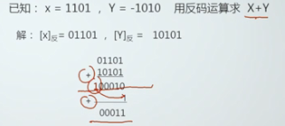
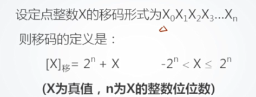
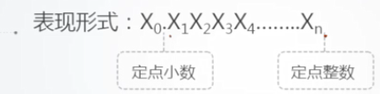
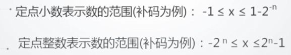
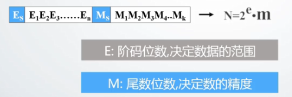
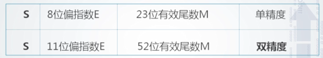
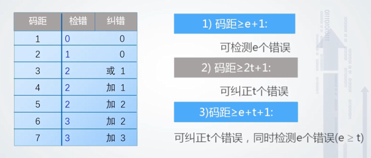
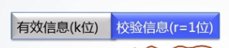

# 第二章 数据表示

## 2.1 机器数机器特点

### 2.1.1 为什么研究机器内的数据表示

#### 1 目的

​	组织数据，方便计算机硬件直接使用

#### 2 要考虑的因素

* 支持的数据类型
* 能表示的数据范围
* 能表示的数据精度
* 储存和处理的代价（运算器的优化和简化）
* 是否有利于软件的移植
* ……

### 2.2.2 机器内部数据表示

#### 1 真值

​	符号用“+”、“-”表示的数据表示方法

#### 2 机器数

​	符号数值化的表示方法，0、1表示符号（不能说0表示正，1表示负，因为移码的符号位的含义与其他三种是不同的）

#### 3 三种常见机器数+移码

* 原码

  表示简单

  运算复杂（符号位不参与运算，不便于设计加法器、减法器）

  0的表示不唯一

* 反码

  表示相对复杂

  运算相对于原码简单：符号位参与运算，只需要设置加法器，但**符号位的进位位需要加到最低位**，反码加法需要执行两次加法，期间需要判断（复杂度较高）

  

  0的表示不唯一

* 补码

  表示相对于原码复杂，[x]补 = 2^(n+1)+X

  运算简单：只需要设置加法器
  
  0的表示唯一
  
  **补码中的模**：符号位仅为后所在位的位权
  
  字长为**N**的机器的补码的模为**2^N**
  
* 移码（增码）

  移码表示浮点数的阶码，IEEE754中阶码用移码表示

  定义：

  

  移码的**数值位与X的补码相同，符号位与补码相反**

  移码的表示与补码相反，在数轴上的完全遵循从小到大的模式的。

  

## 2.2 定点数与浮点数表示

### 2.2.1 定点数表示

**可以表示定点小数和整数**

小数点固定，省去了表示小数点的步骤，可以充分的利用字长，表示出更大范围/精度的数

* 定点数的表示范围

  

* 定点数表示的不足——**表示数据的范围受限**

### 2.2.2 浮点数表示

**把数的范围和精度分别表示的一种数据表示方法**

* 使用场合——当数的表示范围超出了定点数能表示的范围时

#### 1 格式（一般格式）

* 一般表示的不足

  数据移植性太差

#### 2 IEEE 754格式

* 阶码使用移码表示，偏移值为127（单精度）、1023（双精度），将浮点数的阶码值变成非负整数，便于浮点数的比较和排序

## 2.3 数据校验的基本原理

### 2.3.1 数据校验的必要性

​	1.受元器件的质量、电路故障或噪音干扰等因素的影响，数据在被处理、传输、存储的过程中可能出现储物。

​	2.若能设计硬件层面的作物检测机制，可以减少基于软件检错的代价（系统观）。

### 2.3.2 校验的基本原理

​	增加冗余码

​	校验信息基于有效信息计算得出

### 2.3.3 码距

* 统一编码中，**任意两个合法编码**之间不同二进制数的最小值

​	0011与0001的码距为1，一位出错时无法识别

​	0000，0011，0202，0110，1001，1010，1100，1111等编码码距为2，任何一位发生改变，就能检测到出错

* 校验码中增加冗余项的目的就是为了增大码距，使接收方能够识别错误，甚至能够根据校验码纠正错误

### 2.3.4 码距大小与检错纠错能力的关系

* 码距越大，抗干扰能力越强，纠错能力越强，但数据冗余越大，编码效率低，编码电路也相对复杂。
* 选择码距必须考虑信息发生差错的概率和系统容许的最小差错率。

## 2.4 奇偶校验

### 2.4.1 奇偶校验基本原理

​	1.增加冗余码（校验位）——一位

