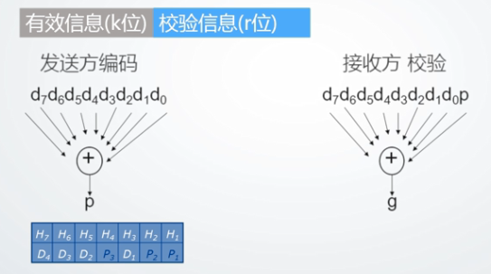
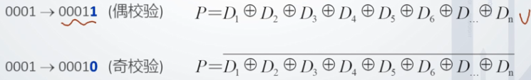
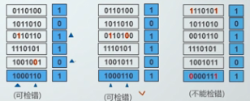

# 第二章 数据表示

## 2.1 机器数机器特点

### 2.1.1 为什么研究机器内的数据表示

#### 1 目的

​	组织数据，方便计算机硬件直接使用

#### 2 要考虑的因素

* 支持的数据类型
* 能表示的数据范围
* 能表示的数据精度
* 储存和处理的代价（运算器的优化和简化）
* 是否有利于软件的移植
* ……

### 2.2.2 机器内部数据表示

#### 1 真值

​	符号用“+”、“-”表示的数据表示方法

#### 2 机器数

​	符号数值化的表示方法，0、1表示符号（不能说0表示正，1表示负，因为移码的符号位的含义与其他三种是不同的）

#### 3 三种常见机器数+移码

* 原码

  表示简单

  运算复杂（符号位不参与运算，不便于设计加法器、减法器）

  0的表示不唯一

* 反码

  表示相对复杂

  运算相对于原码简单：符号位参与运算，只需要设置加法器，但**符号位的进位位需要加到最低位**，反码加法需要执行两次加法，期间需要判断（复杂度较高）

  

  0的表示不唯一

* 补码

  表示相对于原码复杂，[x]补 = 2^(n+1)+X

  运算简单：只需要设置加法器
  
  0的表示唯一
  
  **补码中的模**：符号位仅为后所在位的位权
  
  字长为**N**的机器的补码的模为**2^N**
  
* 移码（增码）

  移码表示浮点数的阶码，IEEE754中阶码用移码表示

  定义：

  

  移码的**数值位与X的补码相同，符号位与补码相反**

  移码的表示与补码相反，在数轴上的完全遵循从小到大的模式的。

  

## 2.2 定点数与浮点数表示

### 2.2.1 定点数表示

**可以表示定点小数和整数**

小数点固定，省去了表示小数点的步骤，可以充分的利用字长，表示出更大范围/精度的数

* 定点数的表示范围

  

* 定点数表示的不足——**表示数据的范围受限**

### 2.2.2 浮点数表示

**把数的范围和精度分别表示的一种数据表示方法**

* 使用场合——当数的表示范围超出了定点数能表示的范围时

#### 1 格式（一般格式）

* 一般表示的不足

  数据移植性太差

#### 2 IEEE 754格式

* 阶码使用移码表示，偏移值为127（单精度）、1023（双精度），将浮点数的阶码值变成非负整数，便于浮点数的比较和排序

## 2.3 数据校验的基本原理

### 2.3.1 数据校验的必要性

​	1.受元器件的质量、电路故障或噪音干扰等因素的影响，数据在被处理、传输、存储的过程中可能出现储物。

​	2.若能设计硬件层面的作物检测机制，可以减少基于软件检错的代价（系统观）。

### 2.3.2 校验的基本原理

​	增加冗余码

​	校验信息基于有效信息计算得出

### 2.3.3 码距

* 统一编码中，**任意两个合法编码**之间不同二进制数的最小值

​	0011与0001的码距为1，一位出错时无法识别

​	0000，0011，0202，0110，1001，1010，1100，1111等编码码距为2，任何一位发生改变，就能检测到出错

* 校验码中增加冗余项的目的就是为了增大码距，使接收方能够识别错误，甚至能够根据校验码纠正错误

### 2.3.4 码距大小与检错纠错能力的关系

* 码距越大，抗干扰能力越强，纠错能力越强，但数据冗余越大，编码效率低，编码电路也相对复杂。
* 选择码距必须考虑信息发生差错的概率和系统容许的最小差错率。

## 2.4 奇偶校验

### 2.4.1 奇偶校验基本原理

​	1.增加冗余码（校验位）——一位

​	2.编码：根据有效信息计算校验信息位，使校验码（数据+1位校验信息）中的1的个数满足奇/偶校验的要求

​	1.检错方法与电路

奇校验逻辑表达式与电路

偶校验逻辑表达式与电路

### 2.4.2 奇偶校验特点

* 编码与检错简单
* 编码效率高
* 不能同时检测偶数位错误，无错结论不可靠，是一种错误检测吗（出错结论可靠）
* 不能定位错误，没有纠错能力

### 2.4.3 奇偶校验的码距

​	奇偶校验码距——2

### 2.4.5 改进的奇偶校验

​	双向奇偶校验、方块校验、垂直水平校验——对几条数据进行分组，同时在行、列设置奇偶校验位

* 可纠正一位错误

* 可检测出某行（列）上的奇数位
* 可检出一部分偶数位错误
* 不能检测出错码分布在举行四个顶点上的错误

### 2.4.5 奇偶校验应用

* 奇偶校验的应用场合

  如含9个芯片的内存条位具有检错能力的内存条

* 一般在同步传输方式中采用奇校验，异步传输方式中采用偶校验。（工程应用中，使用奇校验，一定会在一个序列中得到至少一个1，而非全零）

## 2.5 CRC校验及实现

### 2.5.1 CRC校验基本原理

* 增加冗余位（校验位）

  一种状态表示没有错误，剩下的2^r - 1种状态可表示多种错误

* 生成多项式G(x)

  ​	收发双方约定一个(r+1)位二进制数，发送方利用G(x)对多项式做模2运算，生成校验码。接收方利用G(x)对收到的编码多项式做模2除运算检测差错及错误定位。

* G(x)应满足的条件
  * 最高位和最低位必须为1；
  * 党被传送信息（CRC码）任何一位发生错误时，被生成多项式做除后应该使余数不为0
  * 不同位发生错误时，模2除运算后余数不同
  * 对不为0的余数继续进行模2除运算应使余数循环

* 常见生成多项式G(x)

### 2.5.2 模二除运算——CRC校验核心

* 模2运算规则
  * 加/减运算（异或运算，加不进位，减不借位）
    * 0±0=0，0±1=1，1±1=0，1±1=0（异或运算）
  * 模2除法（按模2减，求部分余数，不借位）
  * 上商原则
    * 部分余数首位为1时，商为1，减除数
    * 部分余数首位为0时，商为0，减0
    * 当部分余数的位数小于除数位数，该余数即为最后余数

### 2.5.3 CRC编码方法

（1）根据待校验信息的长度k，按照k + r≤2^r - 1确定校验位r的位数（找最小的满足算式的r）

​	如对4为信息1100进行CRC编码，根据4 + r ≤ 2^r -1，锝r(min) = 3

（2）根据r和生成多项式的选择原则，选择位数为**r+1**的生成多项式 **G(x)= 1011**

（3）进行下列变换（在被校验信息后面补上r个零）

（4）对Q'(x)按模2除运算法则除G(x)，求CRC编码中的r位校验信息

模2除G(x)运算.png)

（5）用得到的余数替换Q'(x)的最后r位即可得到CRC编码

### 2.5.4 CRC的检错与纠错

​	接收方利用G(x)对收到的编码做模2除运算

* 无错情况

​	余数为0，说明传输没有错误

* 有错情况

  接收方利用G(x)对有错的编码多项式做模2除运算

  对有错编码多项式做模2除.png)

  余数不为0，说明传输有错，出错位置不同，余数不同

* （7，4）编码不同位数出错对应的余数

编码不同数位出错对应的余数.png)

​	**采用不同生成多项式，对应的相同出错位，得到的余数不为零的余数是不尽相同的**

* 一位出错情况下，余数具有循环特征

​	对第三位出错的余数，末尾添0后再做除法，余数与第四位出错的余数相同（余数的循环特性）

* 利用出错情况下余数的循环特性进行纠错