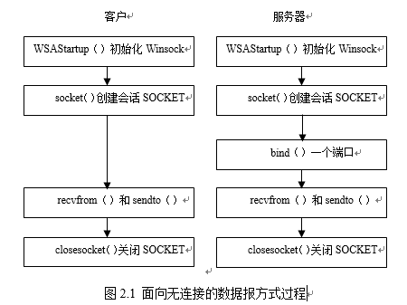
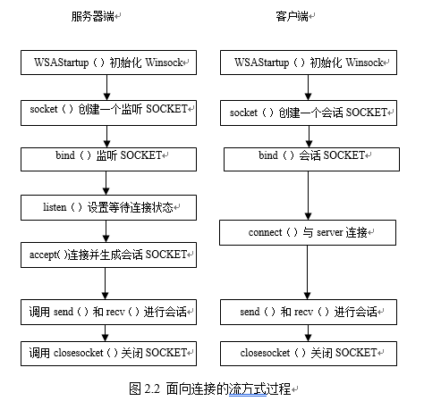

# 一、Socket编程

## 1. 实验目的与内容

**题目：**

编写一个Web服务器软件，要求如下：     

**基本要求：**

* 可配置Web服务器的监听地址、监听端口和主目录；

* 能够单线程处理一个请求。当一个客户（浏览器,输入URL：http://202.103.2.3/index.html）连接时创建一个连接套接字；

* 从连接套接字接收http请求报文，并根据请求报文的确定用户请求的网页文件；

* 从服务器的文件系统获得请求的文件。 创建一个由请求的文件组成的http响应报文。；

* 经TCP连接向请求的浏览器发送响应，浏览器可以正确显示网页的内容；

* 服务可以启动和关闭。

**高级要求：**

* 能够传输包含多媒体（如图片）的网页给客户端，并能在客户端正确显示；

* 在服务器端的屏幕上输出请求的来源（IP地址、端口号和HTTP请求命令行）；

* 在服务器端的屏幕上能够输出对每一个请求处理的结果；

* 对于无法成功定位文件的请求，根据错误原因，作相应错误提示，并具备一定的异常情况处理能力。

## 2. 编程简介

* 使用套接字屏蔽应用程序与底层网络通信协议
* **套接字 = 网络地址 + 端口号**

* **Winsock**

socket的两种类型

* **流类型** ：可靠、面向连接，使用传输控制协议TCP
* **数据报类型** ：不可靠、非连接，使用用户数据报协议UDP

Socket I/O的两种模式

​	一个SOCKET疾病可以看作代表了一个I/O设备，两种I/O模式

* **阻塞式I/O**

  ​	收发数据的函数在调用后一直到传送完毕或者出错才能完成，在阻塞期间，除了等待网络操作的完成，不能进行任何操作。阻塞式I/O是Winsock API函数的缺省行为。

* **非阻塞式I/O**

  ​	Winsock API函数被调用后立即返回；当网络操作完成后，由Winsock给应用程序发送消息（Socket Notifications）通知操作完成，这时应用程序可以根据**发送的消息中的参数**对消息做出响应。Winsock提供了2种**异步接受数据**的方法：一种方法是使用BSD类型的函数**select（）**，另外一种方法是使用Winsock提供的专用函数**WSAAsyncSelect（）**。

使用**数据报**套接字

​	step

* 客户机/服务器创建数据包套接字
* 服务器调用bind()分配公认的端口
* 客户机/服务器使用**sendto()**和**revfron()**传递数据
* 调用**closesocket()**关闭套接字



*************

使用**流式**套接字

​	基于连接，首先需要建立连接



------------------------

## 3. 套接字库函数

### WSAStartup()

```c++
int WSAStart(WORD wVersionRequested,LPWSDATA lpWSAData);
//wVersionRequested 表示欲使用的Windows Socket API版本，WORD类型整数，高字节是次版本号，低字节是主版本号
//lpWASData 指向WSAData资料的指针，WASData是数据结构类型，描述了关于Windows Sockecs底层实现相关信息
/*返回值：
	WSASYSNOTREADY 底层网络未准备好
	WSAVERNOTSUPPORTED Winsock版本不支持
	WSAEINPRIGRESS 阻塞式Winsock1.1存在于进程中
	WSAEPROCLIM 已达到Winsock使用量的上限
	WSAEFAULT lpWSAData不是一个有效的指针
*/
//函数功能：第一个应该调用的Winsock API函数，以完成一系列初始化工作

//WSADATA定义
typedef struct WSAData{
	WORD wVersion；//应用程序应该使用的Winsock版本号
    WORD wHighVersion；//DLL所支持的最高版本号。通常应该等于wVersion
    char szDescription[WSADESCRIPTION_LEN+1];//以0结尾的ASCII字符串，关于Winsock底层实现的描述信息。
    char szSystemStatus[WSASYS_STATUS_LEN+1];//以0结尾的ASCII字符串，关于Winsock底层状态或者配置信息
    unsigned short iMaxSockets;//一个进程最多可使用的套接字数，仅用于Winsock1.1，Winsock 2.0应该忽略该成员
    unsigned short iMaxUdpDg;//最大的UDP报文大小，仅用于Winsock1.1，Winsock 2.0应该忽略该成员。对于Winsock 2.0，应该使用getsockopt函数取得SO_MAX_MSG_SIZE
    char FAR* lpVendorInfo;//Winsock开发厂商信息，，仅用于Winsock1.1，Winsock 2.0应该忽略该成员。对于Winsock 2.0，应该使用getsockopt函数取得PVD_CONFIG
}WSADATA,FAR*LPWSDATA;
```

使用示例：

```c++
#include <winsock.h>
//对于Winsock 2, include <winsock2.h>
WSADATA  wsaData;
int nRc = WSAStartup(0x0101, & wsaData);		
if(nRc)
{
    //Winsock初始化错误
    return;
}
if(wsaData.wVersion != 0x0101)
{
    //版本支持不够
    //报告错误给用户，清除Winsock，返回
    WSACleanup();
    return;
}

```

-----------

### socket()

```c++
SOCKET socket(int af, int type,	int protocol);
//af 指定地址族（address family），一般填AF_INET（使用Internet地址）
//type 指定SOCKET的类型：SOCK_STREAM（流类型），SOCK_DGRAM（数据报类型）。
//protocol 指定af参数指定的地址族所使用的具体一个协议。建议设为0，那么它就会根据地址格式和SOCKET类型，自动为你选择一个合适的协议。另外2个常用的值为：IPPROTO_UDP和IPPROTO_TCP。
/*
返回值
	函数执行成功返回一个新的SOCKET，失败则返回INVALID_SOCKET。这时可以调用WSAGetLastError函数取得具体的错误代码。
*/
//函数功能：所有的通信在建立之前都要创建一个SOCKET
```

示例

```c++
//创建数据报socket
SCOKET udpSock = socket(AF_INET, SOCK_DGRAM,IPPROTO_UDP);
//创建流socket
SCOKET tcpSock = socket(AF_INET,SOCK_STREAM,IPPROTO_TCP);
```

### bind()

```c++
int bind(SOCKET s, const struct sockaddr FAR* name, int namelen);
//s 一个需要绑定的SOCKET，例如用socket函数创建的SOCKET
//name 指向描述通信对象地址信息的结构体sockaddr的指针。在该结构体中可以指定地址族（一般为 AF_INET）、主机的地址和端口。通常把主机地址指定为INADDR_ANY（一个主机可能有多个网卡）
//namelen name指针指向的结构体的长度。
/*
返回值
	函数执行成功返回0，失败则返回SOCKET_ERROR。这时可以调用WSAGetLastError函数取得具体的错误代码。
*/
//函数功能：成功地创建了一个SOCKET后，用bind函数将SOCKET和主机地址绑定
```

### listen()

* 对于服务器的程序，当申请到SOCKET,并将通信对象指定为INADDR_ANY之后，就应该等待一个客户机的程序来要求连接，listen函数就是把一个SOCKET设置为这个状态。

### accept()

* accept函数从等待连接的队列中取第一个连接请求，并且创建一个新的SOCKET来负责与客户端会话。

### connect()

* 向对方主动提出连接请求。

### send()

* 通过已经连接的SOCKET发送数据。

### recv()

* 通过已经连接的SOCKET接收数据。当读到的数据字节少于规定接受的数目（len）时，就把数据全部接收，并返回实际接收到的字节数；当读到的数据多于规定的值时，在流方式下剩余的数据由下个recv读出，在数据报方式下多余的数据被丢弃。

### sendto()

* 该函数一般用于通过无连接的SOCKET发送数据报文，报文的接受者由to参数指定。

### recvfrom()

* 该函数一般用于通过无连接的SOCKET接收数据报文，报文的发送者由from参数指定。

### closesocket()

* 关闭指定的SOCKET。

## 4. Windows Socket 2扩展

